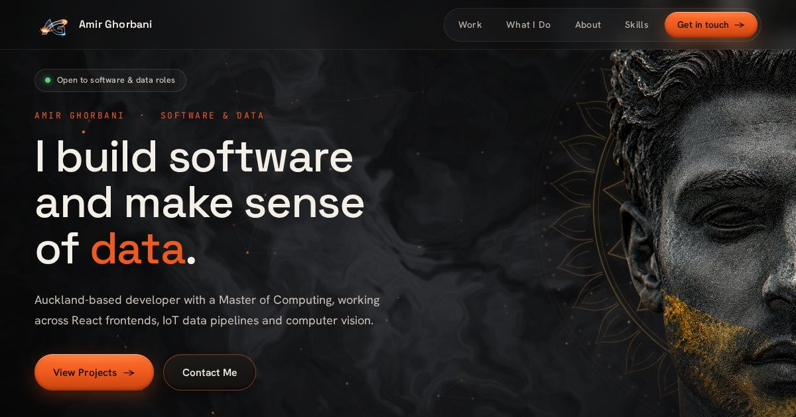

# Amir Ghorbani · Portfolio

Personal portfolio website for **Amir Ghorbani**, a software and data developer based in Auckland, New Zealand, with a Master of Computing. I work across React frontends, data pipelines, SQL and machine learning / computer vision.

**[amirghorbani.dev](https://amirghorbani.dev)**



---

## Overview

A single-page portfolio built with vanilla HTML, CSS and JavaScript, with no build step.

- **Relit statue portrait:** a WebGL shader relights the hero portrait from a pre-baked normal/depth map. The light follows the cursor, the gold dust catches metallic glints, and a warm rim light ties the head into the scene.
- **Persian design details:** a Shamseh (sun medallion) behind the portrait, a Kashan-style rug border under the hero, *lachak* corner pieces on the cards, and the tomb of Cyrus at Pasargadae in the footer.
- **Name in Old Persian cuneiform:** the hero name scrambles between English and cuneiform (a-mi-i-ra · gu-u-ra-ba-a-na-i). Screen readers always get the English name.
- **Atmosphere:** WebGL neural-noise background, 3D particle network, rising embers and scroll-driven reveals.
- **Contact form:** terminal-styled, delivered through [Web3Forms](https://web3forms.com).

### Featured Projects

| Project | Description | Links |
|---------|-------------|-------|
| **AI Strawberry Disease Detection** | Master's thesis: hybrid YOLOv9 + DETR model for disease and ripeness detection, about 90% accuracy across 9,000+ images | [Repo](https://github.com/AmirmasoudGhorbani/hybrid-yolov9-detr-strawberry-disease) |
| **Scalable Rental Platform** | Interactive AWS architecture diagram with animated request tracing and Terraform IaC | [Live Demo](https://amirghorbani.dev/rental-platform-architecture/architecture/) · [Repo](https://github.com/AmirmasoudGhorbani/rental-platform-architecture) |
| **IoT Weather Monitoring** | Real-time data pipeline from Raspberry Pi sensors over MQTT and Node-RED into a live dashboard, with live Auckland weather data | [Live Demo](https://amirghorbani.dev/iot-weather-station/dashboard/) · [Repo](https://github.com/AmirmasoudGhorbani/iot-weather-station) |
| **TV Signal Solutions Website** | Responsive marketing site for a local Auckland installation business | [Live Site](https://signal-solution-website.vercel.app) · [Repo](https://github.com/AmirmasoudGhorbani/Signal-Solution-Website) |
| **Kebab Station Kumeu** | Live site for a Kumeu takeaway, with menu, reviews and an interactive kebab builder | [Live Site](https://kebabstationkumeu.com/) · [Repo](https://github.com/AmirmasoudGhorbani/Takeaway-food-business) |

## Tech Stack

- **Software:** JavaScript, TypeScript, React, Next.js, HTML, CSS, Node.js, Git
- **Data & machine learning:** Python, SQL, PostgreSQL, MySQL, PyTorch, YOLOv9, DETR, computer vision, MQTT and Node-RED
- **Cloud & DevOps:** AWS (EC2, ECS, S3, RDS, Route 53), Docker

## Quality

Checked against the pre-launch checklist from my [WebDev-Handbook](https://github.com/AmirmasoudGhorbani/WebDev-Handbook):

- **Accessibility:** no axe violations on desktop or mobile, a skip link, sufficient contrast, and support for reduced motion.
- **Performance:** project images are served as responsive WebP (800w / 1600w) with PNG fallbacks, fetched in the background after page load and faded in when ready.
- **SEO:** canonical URL, Open Graph and Twitter cards with a 1200×630 share image, Person structured data, `robots.txt`, `sitemap.xml` and a custom `404.html`.

## Repository Structure

```
Portfolio/
├── index.html                          # main portfolio page
├── styles.css                          # design system
├── script.js                           # interactions, WebGL portrait relighting, animations
├── persian.css / persian.js            # Persian motifs and the cuneiform name
├── 404.html
├── robots.txt / sitemap.xml
├── site.webmanifest
├── CNAME
├── assets/
│   ├── ag-logo-*, icon-*.png           # logo and app icons
│   └── Amir-Ghorbani-CV.pdf            # downloadable CV
├── images/                             # project screenshots (WebP + PNG), portrait, share image
├── iot-weather-station/                # IoT dashboard (subpage)
│   ├── dashboard/
│   ├── firmware/
│   └── node-red/
└── rental-platform-architecture/       # cloud architecture (subpage)
    ├── architecture/
    ├── infrastructure/
    └── docs/adr/
```

## Development

No build step required. Serve the folder with any static server:

```bash
npx serve .
```

## Deployment

Hosted on **GitHub Pages** behind Cloudflare, with a custom domain set in the `CNAME` file. Pushing to `main` deploys the site.

## License

MIT, see [LICENSE](./LICENSE).
