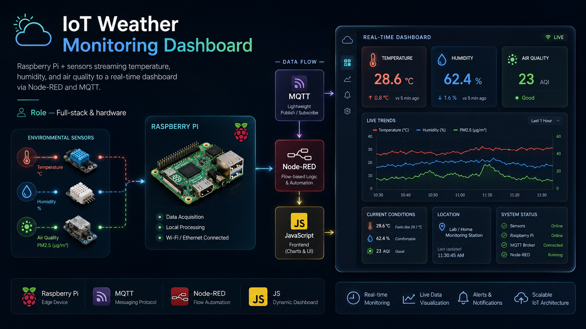

# IoT Weather Monitoring Station

Real-time environmental monitoring built on a **Raspberry Pi**. On-board sensors stream **temperature**, **humidity**, and **air quality (PM2.5)** to a live web dashboard over **MQTT**, with **Node-RED** handling flow logic and alerting.




---

## Live Demo

**[View the live dashboard](https://amirghorbani.dev/iot-weather-station/dashboard/)** — runs on real Auckland weather data by default (Open-Meteo API), no hardware required.

---

## Architecture

```
  Sensors            Edge Device           Broker          Logic            Frontend
┌──────────┐       ┌─────────────┐       ┌────────┐     ┌──────────┐     ┌────────────┐
│ DHT22    │──────▶│             │       │        │     │          │     │            │
│ (temp/RH)│       │ Raspberry   │──────▶│  MQTT  │────▶│ Node-RED │────▶│  Dashboard │
│ PMS5003  │──────▶│ Pi          │ JSON  │ broker │ sub │  flows   │ ws  │ (HTML/JS)  │
│ (PM2.5)  │       │ publisher.py│       │        │     │ + alerts │     │  live UI   │
└──────────┘       └─────────────┘       └────────┘     └──────────┘     └────────────┘
```

## Data Sources

The dashboard supports three modes, selectable via a dropdown:

| Mode | Description |
|------|-------------|
| **Auckland (live)** | Real temperature, humidity and PM2.5 from the free [Open-Meteo](https://open-meteo.com) API. Backfills 48 hours of real hourly data. |
| **Simulated** | Realistic in-browser random-walk data. No backend required. |
| **Live MQTT** | Connects to your MQTT broker over WebSocket and renders real Raspberry Pi sensor data. |

## Hardware

| Component | Part | Connection |
|-----------|------|------------|
| Compute | Raspberry Pi 4 | — |
| Temp / Humidity | DHT22 / AM2302 | GPIO4 (1-wire data) |
| Air quality | PMS5003 | UART (`/dev/serial0`) |

> No hardware? Every script includes a `--simulate` flag that produces realistic drifting values so you can run the full pipeline on any machine.

## Quick Start

**1. Broker**
```bash
docker run -it -p 1883:1883 -p 9001:9001 eclipse-mosquitto
```

**2. Publisher**
```bash
cd firmware
pip install -r requirements.txt
cp config.example.json config.json

python sensor_publisher.py              # real sensors
python sensor_publisher.py --simulate   # no hardware
```

**3. Node-RED** — import `node-red/flow.json` via Menu → Import, then deploy.

**4. Dashboard** — open `dashboard/index.html` in a browser.

## MQTT Payload

Published to `amir/iot/weather` (configurable):

```json
{
  "temperature": 26.4,
  "humidity": 61.2,
  "pm25": 18.0,
  "ts": 1718900000
}
```

## Repository Structure

```
iot-weather-station/
├── firmware/
│   ├── sensor_publisher.py     # reads sensors, publishes to MQTT
│   ├── requirements.txt
│   └── config.example.json
├── node-red/
│   └── flow.json               # importable Node-RED flow
├── dashboard/
│   ├── index.html              # live web dashboard
│   ├── styles.css
│   └── app.js
└── preview.png
```

## License

MIT — see [LICENSE](./LICENSE).
