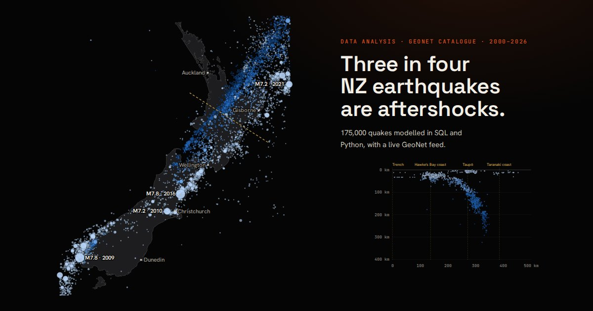

# NZ Earthquake Analysis

**Three in four New Zealand earthquakes are aftershocks.**

An analysis of 175,390 earthquakes (magnitude 2.5+, January 2000 to October 2026) from GeoNet's catalogue, modelled in SQL with DuckDB and Python, with a live feed from GeoNet's API.

**[Live dashboard →](https://amirghorbani.dev/nz-earthquakes/dashboard/)** · **[Analysis notebook →](notebooks/analysis.ipynb)**



## Questions

1. Where do New Zealand's earthquakes happen, and how deep?
2. How often does each size come?
3. How quickly do aftershocks fade?
4. Once aftershocks are removed, is the background rate steady?
5. What's a normal year near each city?
6. Can the catalogue be trusted as it stands?

## Key findings

| | Finding |
|---|---|
| **Mostly aftershocks** | Of 27,933 M3+ quakes since 2012, only 24% are mainshocks (Gardner–Knopoff declustering). Mainshocks hold at about 400–500 a year; 2016 had 4,816 M3+ quakes but only 424 mainshocks. |
| **Magnitude–frequency** | b = 0.88 (95% bootstrap interval 0.87–0.89, stable for cut-offs M2.6–M3.6), so each whole magnitude is about 7.6 times rarer. New Zealand averages about 26 M5+ and two M6+ quakes a year. |
| **Aftershock decay** | Omori fits: Kaikōura 2016 p = 1.31 (522 M3.5+ aftershocks in the first day, and a month later the daily rate was about 1/62 of day one); Darfield 2010 p = 1.01. |
| **The plate boundary** | A cross-section from the Hikurangi trench shows quakes tracing the Pacific plate as it dives to more than 200 km deep west of Taupō. 68% of M3+ quakes are shallower than 40 km. |
| **Near the cities** | Within 100 km, Palmerston North, Napier, Gisborne, Wellington and Christchurch see about 3–5 shallow M4+ mainshocks a year; Auckland has had one in 14 years. |

## Data-quality findings

- **The 2012 magnitude change.** When GeoNet moved to its SeisComP system in 2012 (event IDs change format at the same point, from numbers like `3366146` to `2012p…`), yearly M3+ counts halved overnight while M5+ counts didn't change (25 vs 26 a year). Matching rates gives the translation: an old M3.0 is about a modern M2.65, an old M4.0 about M3.76, and the scales agree by M5. All rates and fits here use 2012 onwards; a trend across 2012 would wrongly show New Zealand getting calmer.
- **Detection depends on the time of day.** About 13% fewer small quakes are detected during working hours than at night, because of noise from traffic and machinery.
- **Not every event is an earthquake.** The catalogue includes quarry blasts (72% go off at noon or 3pm), landslides, snow avalanches, the 2022 Hunga Tonga eruption and North Korea's 2017 nuclear test. Only events typed as earthquakes (or unknown, the label many 2012–2018 events kept) inside 34–48°S, 165–180°E are analysed.
- **API limits.** The FDSN service caps a request at 10,000 events, so busy years (2009–2011, 2016) are fetched in halves.

## Method

- **Model:** the raw exports are loaded, typed and de-duplicated in DuckDB (`sql/01_staging.sql`), then summarised in SQL views (`sql/02_analysis.sql`): annual counts, the scale-change comparison, the magnitude–frequency distribution, hour of day and event types.
- **Declustering:** Gardner–Knopoff (1974) space–time windows on M3+ quakes since 2012. The windows are generous, so some independent quakes are counted as aftershocks.
- **b-value:** Aki's maximum-likelihood estimate with Utsu's binning correction, above M3.0, with a 500-sample bootstrap.
- **Aftershocks:** the modified Omori law, n(t) = K / (c + t)^p, fitted by maximum likelihood to M3.5+ aftershocks from 1.2 hours after the mainshock (the earliest small aftershocks are missed while the mainshock is still shaking).
- **City rates:** shallow (<40 km) mainshocks within 100 km of each city, 2012–2025. These are observed rates, not a hazard forecast; see GNS Science's National Seismic Hazard Model for that.
- **Live panel:** the dashboard calls GeoNet's public API (`/quake` and `/quake/stats`) from the visitor's browser, so it's always current without storing anything.

## Project structure

```
nz-earthquakes/
├── data/raw/              # GeoNet catalogue by year (gzipped), NZ coastline
├── sql/
│   ├── 01_staging.sql     # load, type, de-duplicate, define the study region
│   └── 02_analysis.sql    # analysis views
├── pipeline/
│   ├── fetch.py           # download the catalogue and coastline
│   └── build.py           # run the SQL, decluster, fit, export dashboard/data.json
├── notebooks/
│   ├── analysis.ipynb     # walkthrough with checks and charts
│   └── make_notebook.py   # regenerates and executes the notebook
└── dashboard/             # static site: index.html, app.js, styles, data.json
```

## Run it

```bash
pip install duckdb pandas numpy scipy matplotlib nbformat nbclient ipykernel
python pipeline/fetch.py    # optional: refresh the catalogue from GeoNet
python pipeline/build.py    # rebuild the model and dashboard data
python notebooks/make_notebook.py  # regenerate the notebook
npx serve .                 # open http://localhost:3000/dashboard/
```

## Data and credits

Earthquake data: [GeoNet](https://www.geonet.org.nz/), New Zealand's geological hazard monitoring system, used under its [data policy](https://www.geonet.org.nz/policy) with attribution. Coastline: [Natural Earth](https://www.naturalearthdata.com/) (public domain).

## Built with

SQL (DuckDB) · Python (pandas, NumPy, SciPy, matplotlib) · Jupyter · REST APIs · vanilla JavaScript and SVG for the dashboard, with no chart library.
