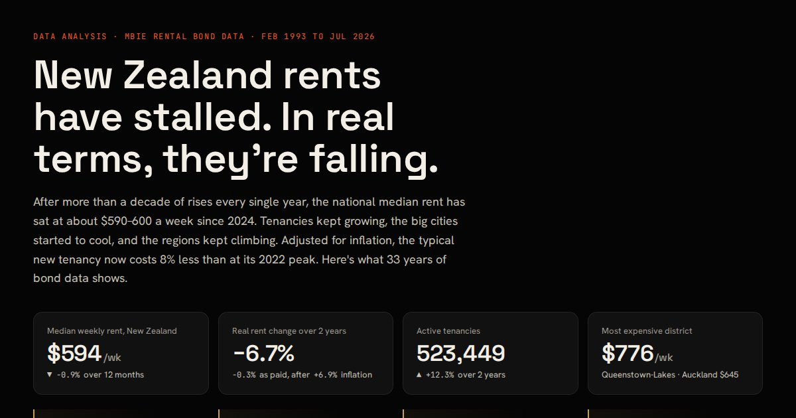

# NZ Rental Market Analysis

**New Zealand rents have stalled. In real terms, they're falling.**

An analysis of 33 years of New Zealand rental bond data (February 1993 to July 2026), modelled in SQL with DuckDB and presented as an interactive dashboard.

**[Live dashboard →](https://amirghorbani.dev/nz-rental-market/dashboard/)** · **[Analysis notebook →](notebooks/analysis.ipynb)**



## Questions

1. How have rents changed nationally, by region, and by district?
2. Is the recent slowdown real, and how unusual is it?
3. What does the picture look like after inflation?
4. Did more rental supply cool the market?
5. Are there seasonal patterns in when people move and what they pay?

## Key findings

| | Finding |
|---|---|
| **Stalled** | The national median rent for new tenancies has held at about $590–600 a week since 2024, after rising every year from 2011 to 2024. It's the first flat spell since 2009–10, and only the third in 33 years. |
| **Falling in real terms** | Over the last two years rents moved −0.3% as paid while prices rose 6.9%, a **6.7% real fall**. In today's dollars, new tenancies peaked in Q1 2022 and now cost **8% less**. |
| **Cities cool, regions climb** | Wellington City is down 6.2% in two years and Auckland is flat, while the West Coast (+10.8%), Southland (+9.5%) and Otago (+8.0%) are still rising. |
| **Supply isn't the local story** | Tenancies grew 6–8% a year nationally, but across 43 districts faster tenancy growth shows **no link** to slower rent growth (Pearson r = 0.07, p = 0.66; Spearman ρ = 0.10). The supply hypothesis was tested and rejected. |
| **New vs sitting tenants** | Since June 2018, new-tenancy rents rose 40%, ahead of inflation (34%), while rents for all tenants (CPI rentals) rose 29% and only 0.5% in the last year. |
| **A rental season** | January and February see about 18–20% more new tenancies than the trend; October is the cheapest month to sign a lease. |
| **Cheap end squeezed** | The upper-to-lower quartile rent ratio fell from 1.73 (2015) to 1.44: the cheapest rentals have risen fastest. |

## Data

| Source | Contents |
|---|---|
| [Tenancy Services (MBIE): rental bond data](https://www.tenancy.govt.nz/about-tenancy-services/data-and-statistics/rental-bond-data/) | Monthly bonds by territorial authority and by region since February 1993; quarterly bonds by dwelling type and bedrooms since 2020 (by Stats NZ SA2 area) |
| [Stats NZ: Consumers price index, June 2026 quarter](https://www.stats.govt.nz/) | All-groups CPI (`SE9A`) and actual rentals for housing (`SE904101`), June 2018 to June 2026 |

A bond is lodged when a new tenancy starts, so bond data measures rents on **new** tenancies. Rents are weekly NZD.

## Method

- **Model:** the raw files are loaded and typed in DuckDB (`sql/01_staging.sql`), then analysed in SQL views (`sql/02_analysis.sql`): trends, regional and district scorecards, seasonality, the supply test and real rents.
- **Smoothing:** comparisons use 12-month trailing averages of the monthly median, built with window functions, so seasonality doesn't distort growth figures.
- **Seasonality:** each calendar month's ratio to a centred 12-month average, averaged over 2010–2019.
- **Real rents:** the quarterly average of the national median deflated by all-groups CPI into June 2026 dollars.
- **Rankings:** districts need a full 12 months of data and at least 30 new bonds a month.

## Data quality

- **Reconciliation:** active tenancies summed across districts match regional totals within 0.6% in every month except April 2020 (COVID-19 lockdown, when small districts went unpublished). This is asserted in the notebook.
- **Bedroom coding change:** from 2024 Q4 the share of bonds with no bedroom count jumps from about 7% to 27%, and from 2025 Q4 those unknowns appear to be recorded as "1 bedroom" (its share leaps from 14% to 54%). Bedroom breakdowns therefore use 2020 Q1 to 2024 Q3 only; totals are unaffected.
- **Exclusions:** bonds with no recorded district or region are dropped from area-level analysis.

## Limitations

- Bond data covers new tenancies only, not rents paid by sitting tenants (the CPI rentals index is used for that comparison).
- Most figures are nominal; the inflation-adjusted view covers June 2018 onwards, the span of the CPI release workbook.
- Medians for small districts are noisy, and correlation across districts can't establish causes. The suggested drivers (interest rates, migration, local demand) are hypotheses, not tested results.

## Project structure

```
nz-rental-market/
├── data/raw/              # source files as downloaded
├── sql/
│   ├── 01_staging.sql     # load and type the raw data
│   └── 02_analysis.sql    # analysis views
├── pipeline/build.py      # runs the SQL, extracts CPI, exports dashboard/data.json
├── notebooks/
│   ├── analysis.ipynb     # walkthrough with checks and charts
│   └── make_notebook.py   # regenerates and executes the notebook
└── dashboard/             # static site: index.html, app.js, styles.css, data.json
```

## Run it

```bash
pip install duckdb openpyxl pandas matplotlib scipy nbformat nbclient ipykernel
python pipeline/build.py           # rebuild the model and dashboard data
python notebooks/make_notebook.py  # regenerate the notebook
npx serve .                        # open http://localhost:3000/dashboard/
```

To refresh with newer data, replace the files in `data/raw/` with the latest MBIE and Stats NZ releases and run the build again.

## Built with

SQL (DuckDB) · Python (pandas, SciPy, matplotlib) · Jupyter · vanilla JavaScript and SVG for the dashboard, with no chart library.
