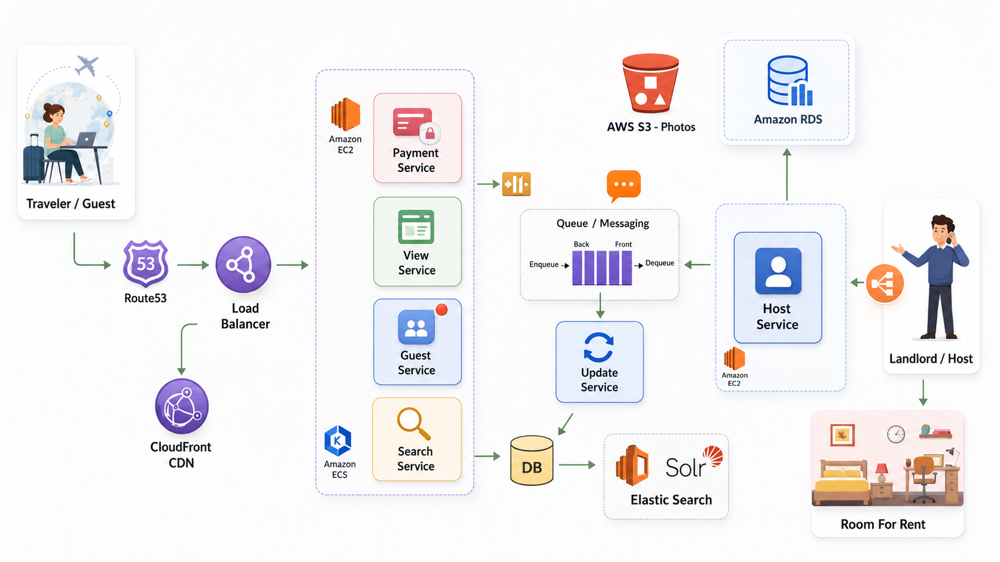

# Scalable Rental Platform — AWS Architecture

A reference architecture for an **Airbnb-style rental marketplace** on AWS. The design separates a read-heavy browse/search path from a write path that flows through a durable queue, so each can scale independently.




---

## Live Demo

**[View the interactive diagram](https://amirghorbani.dev/rental-platform-architecture/architecture/)** — click any component for details, trace a booking or listing flow end-to-end, and toggle read/write path highlighting.

---

## System Overview

```
Traveler ─▶ Route 53 ─▶ ALB ─▶ ┌─ View Service  (EC2)  read
                │              ├─ Guest Service (EC2)  read/write
                │              ├─ Payment Service(EC2)  write ─▶ Queue
                ▼              └─ Search Service(ECS) ─▶ Elasticsearch
           CloudFront (static + photos via S3)

Landlord ─▶ Host Service (EC2) ─┬─▶ RDS            (listing system of record)
                                ├─▶ S3             (photos → CloudFront)
                                └─▶ SQS ─▶ Update Service ─▶ Primary DB ─▶ Elasticsearch
```

### Read Path

`Traveler → Route 53 → ALB → View/Search Service → Elasticsearch / read replicas`

Optimised for low latency and high QPS. Served from caches, the search index, and read replicas — it never blocks on write traffic.

### Write Path

`Landlord → Host Service → SQS → Update Service → Primary DB + Elasticsearch`

Writes are asynchronous: the Host Service enqueues an event and returns immediately. The Update Service drains the queue, persists to the DB, and re-indexes search.

## Components

| Component | AWS Service | Role |
|-----------|-------------|------|
| Route 53 | Route 53 | DNS resolution + health-checked routing |
| CloudFront | CloudFront | Edge cache for static assets and listing photos |
| Load Balancer | ALB | TLS termination, path-based routing to services |
| View Service | EC2 | Renders listing pages (read-only, cache-friendly) |
| Guest Service | EC2 | Guest profiles, bookings, trip management |
| Payment Service | EC2 | Payment processing, emits booking events |
| Search Service | ECS | Catalog search against Elasticsearch |
| Host Service | EC2 | Listing CRUD, photo uploads, enqueues updates |
| Queue | SQS | Durable buffer decoupling writers from consumers |
| Update Service | EC2/ECS | Drains queue → writes DB → re-indexes search |
| Primary DB | RDS / Aurora | Source of truth for listings and bookings |
| Elasticsearch | OpenSearch | Sub-100ms faceted search and filtering |
| S3 | S3 | Durable object storage for photos (CDN origin) |

## Why It Scales

- **Read/write separation** — browse traffic hits caches and read replicas; it is never blocked by writes
- **Queue-buffered writes** — SQS absorbs bursts, turning spiky writes into a steady stream the DB can handle
- **Stateless services** — every tier is stateless behind the ALB; Auto Scaling adds/removes instances freely
- **Independent search scaling** — Elasticsearch scales reads separately from the primary database
- **Edge delivery** — CloudFront serves photos from POPs near users, cutting latency and origin cost

## Interactive Diagram

The `architecture/` directory contains a self-contained interactive diagram. Features:

- **Click any component** → panel with responsibility, AWS service, and scaling notes
- **Trace a booking** → animates a guest request through the full system
- **Post a listing** → traces a landlord publishing a room end-to-end
- **Read path / Write path** → highlights how browsing differs from writing

## Repository Structure

```
rental-platform-architecture/
├── architecture/
│   ├── index.html          # interactive diagram (self-contained)
│   ├── styles.css
│   └── app.js
├── infrastructure/         # Terraform stubs expressing the topology
│   ├── providers.tf
│   ├── variables.tf
│   ├── network.tf          # VPC, subnets, ALB
│   ├── compute.tf          # ECS cluster, services, auto scaling
│   ├── data.tf             # RDS, S3, SQS, OpenSearch
│   ├── edge.tf             # Route 53, CloudFront
│   └── outputs.tf
├── docs/adr/               # Architecture Decision Records
│   ├── 0001-microservices-on-ecs-ec2.md
│   ├── 0002-queue-based-async-writes.md
│   ├── 0003-elasticsearch-for-search.md
│   └── 0004-cloudfront-for-media.md
└── preview.png
```

> The Terraform under `infrastructure/` is an illustrative skeleton — resource shapes and wiring, not a hardened production module.

## License

MIT — see [LICENSE](./LICENSE).
